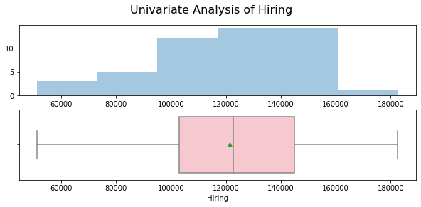
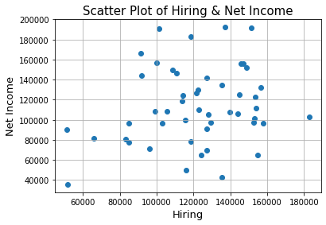
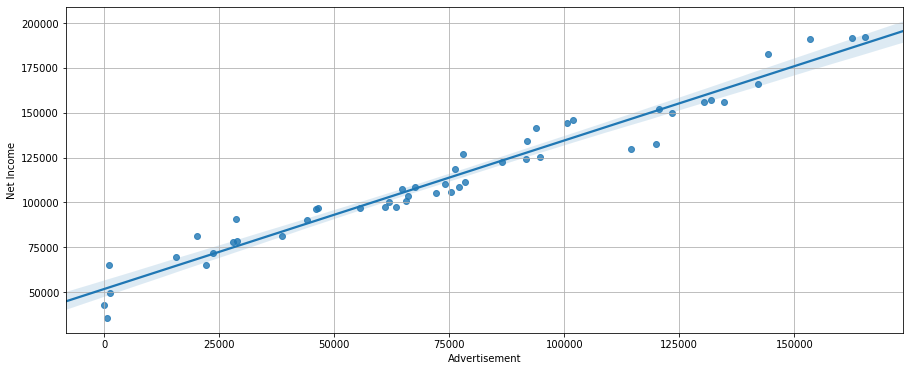
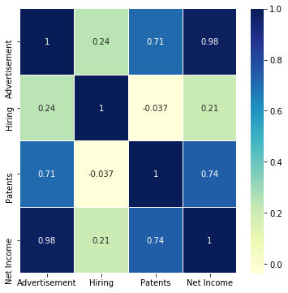
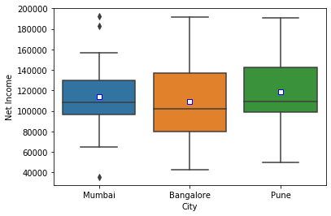
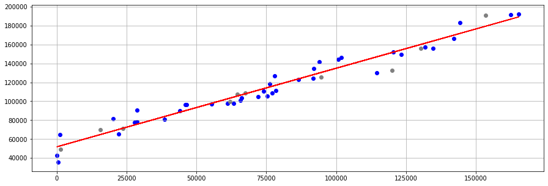
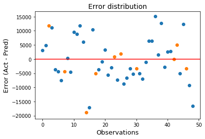

## Data Analysis and Visualisation to predict Net Income

In this project I'm trying to analyze and visualize the Net Income from the dataset based on Advertisement,Hiring,Patents and City in order to predict the most probable Net Income Value.

In these Analysis I have Performed different Steps as follows:

1)Data Cleaning
    outlier treatment
    column rename
    drop unwanted Column
   
2)Exploratory Data Analysis
    Univariant Analysis
    Bivariant Analysis
    Correlation
    Anova

3)Model Development(OLS Model) And Testing
    OlS(min SSE)

4)Error Evaluation
    R-square
    Adjusted R-square

## Softwares and Libraries Used:

       - Anaconda Distribution
	- Jupyter Notebook
	
	- Numpy
	- Pandas
	- Matplotlib
	- Seaborn
    - sklearn 
    - statsmodels
    - warnings
    
## Importing the Modules:

    import pandas as pd
    import os as os
    import numpy as np

    #Visuals
    import matplotlib.pyplot as plt
    import seaborn as sns

    #To split data
    from sklearn.model_selection import train_test_split

    #Models
    import statsmodels.api as sm
    from sklearn.linear_model import LinearRegression

    #Evalution 
    from sklearn.metrics import mean_squared_error, r2_score

    #import warnings
    warnings.filterwarnings("ignore")
    
## Analysis

1)Histogram And Box Plot

2)Scatter Plot

3)Regression Line in Scatter Plot

4)Correlation Using HeatMap

5)Box Plot For Anova

6)Visualization of best fit line

7)Error Distribution

## Conclusion

We can conclude that around 96% of SST can be explained by using this regression equation to predict Net Income on test data.
The remainder is error
